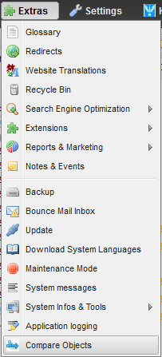
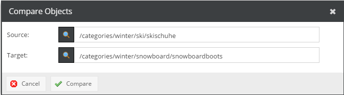

# ObjectMerger

The object merger plugin allows to show the difference between two objects and merge them field by field. For the keyvalue datatype the field is even broken down into key/value pairs.

Open the object selection menu via the Extras | Compare Objects menu item.

You can either paste the full path of the two objects or use the magnifier class to open the search dialog.

Ideally, the two objects should be of the same type.

Click on the Compare button to show the difference between the two objects. You will see a tab for every language. If the objects don't contain any localized fields the tab label will be "Default". The number inside the parenthesis indicate the current number of differences.

The first row shows the full path of both objects. Below that all object fields are listed.

There are 6 columns:

* The exclamation mark indicates that the field content differs
* The second column is the field label
* The (grayed out) button indicates the field type
* The fourth column summarizes the content of the source object. Changes are always applied from the left object to the right object.
* The button in the middle allows to overwrite the data of the target object with the one from the source object. The button turns into a "revert" button which will undo the change.
* The sixth column summarizes the new content of the target object.

Click on save to apply the changes.

### Customizations

The development of the plugin has been discontinued. It has been customized for Kautbullinger where the further development effort was put into. A special requirement for Kautbullinger is that it should be able to show the difference between objects which exist in RAM only, i.e. they haven't been saved before.

In addition it offers two additional features:

* Apply everything at once
* Show/Hide fields that are equal (defaults to hide)
